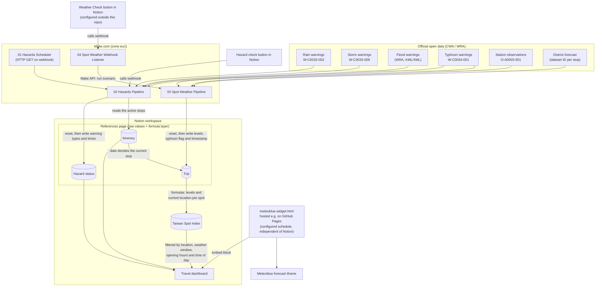
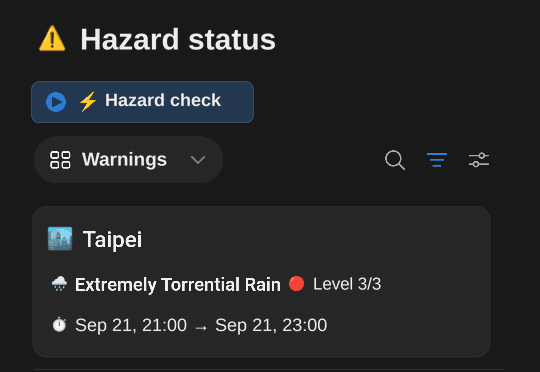
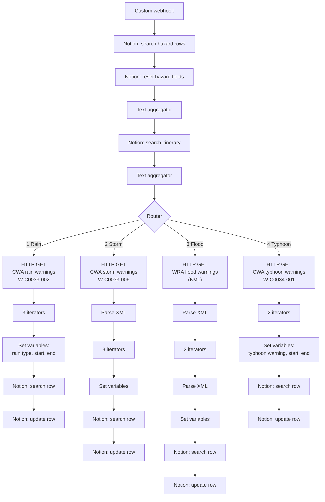
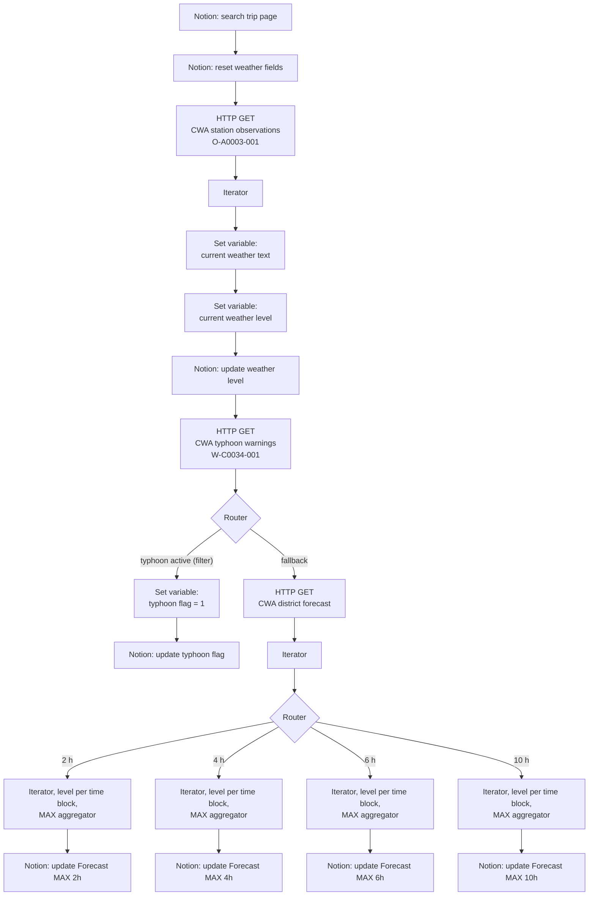
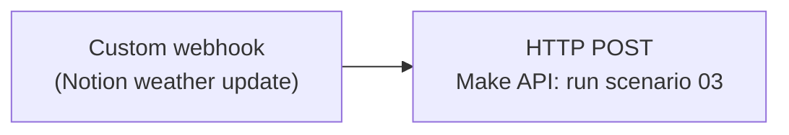
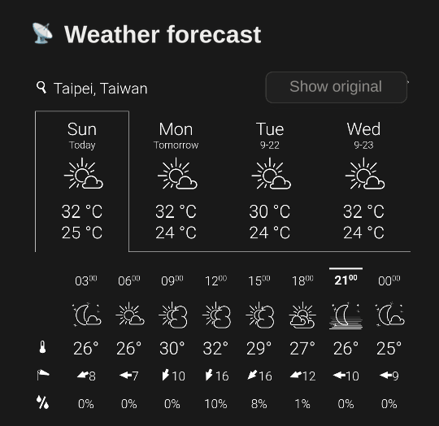

# 🇹🇼 Taiwan Travel - Travel Risk & Weather Intelligence System

A schedule- and event-driven automation built with **Make.com** that pulls official Taiwanese weather and hazard data (CWA / WRA open data), derives simple weather and hazard indicators, and writes them into a **Notion travel workspace**. Everything can be shown on one Notion dashboard, including an embedded Meteoblue forecast widget for the current stop of the trip.

This is a tool for use **during** the trip rather than for planning it. Weather in Taiwan can turn within the hour, which makes the current conditions a poor basis for deciding what to do next — a clear sky says nothing about whether it will still be clear in three hours. That matters because activities have a length: a viewpoint hike is worth starting only if the weather holds for the next two hours, a half-day trip only if it holds considerably longer.

The setup answers that directly. Every spot carries a duration, and the forecast is evaluated across exactly the window that duration covers — so the question the dashboard answers is not "is the weather fine right now" but "will it hold for as long as this activity takes".

---

## 📌 Purpose

When traveling through regions prone to typhoons, heavy rain and floods, checking forecasts manually is easy to forget. This project automates the following:

- Resolve the current stop from the date rather than from GPS, so spots, forecast and guides always belong to the place the itinerary puts you in.
- Fetch official rain, storm, flood and typhoon warnings and map them to the stops of the itinerary.
- Derive a 1–4 weather level per forecast block, so conditions can be compared against what a spot requires.
- Store the maximum forecast level for the next 2, 4, 6 and 10 hours, so a spot's duration can be matched against the weather expected over that window.
- Raise a typhoon flag if a typhoon warning is active.
- Filter the "Pick a Spot" list on the dashboard down to the activities whose weather holds for as long as they take, that are still open, and that suit the time of day.
- Show a location-aware forecast widget inside the Notion dashboard.

---

## 📐 Architecture & Data Flow



> **Note:** The widget does **not** read from Notion. It selects the location from a date schedule configured in the HTML file (see [Widget](#5-dashboard-widget-srcmeteoblue-widgethtml)).

> **Blueprint files:** The JSON files in `blueprints/` are the complete scenarios, exported from Make and then anonymized and translated — credentials and IDs replaced by placeholders, names in English, structure unchanged. The diagrams below describe exactly what is in those files. See [Notes on the blueprint files](#-notes-on-the-blueprint-files).

---

## 📁 Repository Structure

```
.
├── README.md
├── LICENSE
├── blueprints/
│   ├── 01_hazards_scheduler.json
│   ├── 02_hazards_main.json
│   ├── 03_spot_weather_main.json
│   └── 04_spot_weather_webhook.json
├── docs/
│   ├── hazard-status.png
│   ├── pick-a-spot.png
│   └── weather-forecast.png
└── src/
    └── meteoblue-widget.html
```

---

## ⚙️ Subsystems

### 1. Hazards Scheduler (`01_hazards_scheduler.json`)

A single scheduled HTTP module that sends a GET request to the webhook URL of scenario 02. The schedule lives in the Make.com scenario settings and is **not** part of the exported blueprint, so it has to be set up by hand after import. This setup runs it at four fixed times a day — **06:00, 12:00, 18:00 and 22:00** — rather than at a fixed interval.

This is what makes the hazard side self-updating: warnings refresh on their own, and the **Hazard check** button on the dashboard calls the same webhook when an immediate run is wanted. The spot weather side has no such scheduler — see the note below.

### 2. Hazards Pipeline (`02_hazards_main.json`)

Triggered by a custom webhook. It resets the hazard fields, loads the relevant stops and then queries four warning sources via a router. Each route parses the response, extracts the warning type and its start/end time, and writes them to the matching row of the hazard status database.

<p align="center">
  
</p>

The result on the dashboard: the warning type, its level and its validity period. This pipeline runs **both** on the schedule from scenario 01 and on demand via the **Hazard check** button.

Which cards appear follows two rules:

- The card for the **current stop is always shown**, warning or not — so the section is never silently empty.
- Every other stop appears **only when it actually has a warning**. A warning is never suppressed because you are somewhere else: a storm warning for Hualien shows up while you are in Taipei, which is the point — the next stop's weather matters before you get there.



**Regional mapping:** CWA county/city names are matched with the stops of the itinerary:

| CWA `locationName` | Location |
| :--- | :--- |
| `臺北市` | `Taipei` |
| `嘉義縣` | `Alishan` |
| `屏東縣` | `Xiaoliuqiu` |
| `高雄市` | `Kaohsiung` |
| `花蓮縣` | `Hualien` |

> This mapping is hardcoded as module filters — the rain, storm and typhoon routes each carry their own list of accepted county, district or region names. Adding a stop to the trip therefore means editing those filters, not just adding an itinerary row. The spot weather pipeline works the other way round and reads its identifiers from Notion, so the two scenarios do not behave alike here.

### 3. Spot Weather Pipeline (`03_spot_weather_main.json`)

Starts with a search in Notion (no trigger module) and can be started by a schedule or by scenario 04 through the Make API.



**Current weather level:** the weather text of the returned station is converted into a level via nested keyword matching (first match wins, checked from top to bottom):

| Keywords (Chinese) | Meaning | Level |
| :--- | :--- | :---: |
| `雷`, `豪雨`, `大雨` | thunder, torrential rain, heavy rain | **4** |
| `短暫`, `陣雨`, `小雨` | brief/short-lived, showers, light rain | **3** |
| `陰`, `雲` | overcast, cloud | **2** |
| anything else | clear / normal | **1** |

> This keyword matching applies to the **observation** only. It is a separate mechanism from the forecast levels below, which read a numeric code instead, and it describes a single moment rather than a span — which is why the multi-hour horizons driving the spot filter do not use it. The branch still runs on every execution and stores its result.

**Typhoon flag:** set to `1` if a land warning (`陸上颱風警報`) or a sea-and-land warning (`海上陸上颱風警報`) is active (`expires` in the future). The full setup additionally requires the warning to apply to the current stop's CWA region and to not be `urgency = Past`. In the full setup this flag is not just displayed: it switches the spot list off entirely — see [Spot filtering](#spot-filtering-pick-a-spot).

**Forecast levels:** when no typhoon route matched, the fallback route requests the district forecast, derives a level for each time block and stores the maximum per horizon. The maximum is used rather than the average on purpose: one bad block inside a window is enough to rule an activity out, so averaging would smooth away exactly the case the system exists to catch.

The forecast levels are derived from CWA's numeric `WeatherCode`, **not** from the Chinese weather text used for the observation above:

| `WeatherCode` | Meaning | Level |
| :--- | :--- | :---: |
| `1`–`3` | clear to partly cloudy | **1** |
| `4`–`7`, `24`–`28`, `37`–`38` | cloudy, overcast, haze | **2** |
| `8`–`10`, `29`–`30` | showers, occasional rain | **3** |
| anything else | thunder, heavy rain, snow | **4** |

The default branch is what makes this safe: an unrecognised code falls through to `4`, so a weather type nobody anticipated blocks a spot instead of quietly passing it.

Each horizon selects the blocks overlapping a window, and the windows are offset rather than starting at the current minute:

| Horizon | Blocks overlapping |
| :--- | :--- |
| `2h` | now + 30 min … now + 90 min |
| `4h` | now + 1 h … now + 3 h |
| `6h` | now + 1 h … now + 5 h |
| `10h` | now + 1 h … now + 9 h |

The offsets matter when reading the numbers: `Forecast MAX 2h` does not describe the next two hours from this second, but the block or blocks covering roughly the next half hour to hour and a half — which is the span an activity started now would actually run into.

**Spot filtering:** the values this scenario writes are what the spot evaluation reads, which judges each spot against the forecast blocks its duration spans — see [Spot filtering](#spot-filtering-pick-a-spot).

### 4. Webhook Listener (`04_spot_weather_webhook.json`)



Receives a call on a Make custom webhook and starts scenario 03 immediately via the Make API (`POST /api/v2/scenarios/{scenarioId}/run`, token authentication). This allows an on-demand refresh, e.g. after changing the itinerary.

On the dashboard this is wired to the **Weather Check** button in the "Pick a Spot" section (see [Spot filtering](#spot-filtering-pick-a-spot)): pressing it calls this webhook, scenario 03 runs, and the spot list re-filters against the fresh forecast.

> **This is the only way the spot weather updates.** Unlike the hazard side, which has the scheduler in scenario 01, nothing refreshes the forecast evaluation in the background — the list you see reflects the last time the button was pressed. Worth knowing before trusting it after a long break.

The Notion-side trigger that calls this webhook (a Notion button or automation) is **not** part of this repository and has to be set up separately.

### 5. Dashboard Widget (`src/meteoblue-widget.html`)

A standalone HTML page embedding a Meteoblue forecast widget (dark layout, 4 days) in an iframe.

<p align="center">
  
</p>

The location shown follows the date, not Notion: the page picks it from the `SCHEDULE` array described below, so the widget moves to the next stop on its own as the trip progresses.

- **Hosting:** The page has to be served over HTTPS (for example via GitHub Pages) and is then embedded into the Notion dashboard with an embed block. Publishing the file as `index.html` on GitHub Pages is enough.
- **Schedule-based location:** The `SCHEDULE` array at the top of the script maps date ranges (in the `Asia/Taipei` timezone) to one of five locations: `taipei`, `alishan`, `xiaoliuqiu`, `kaohsiung`, `hualien`. Outside all ranges, `DEFAULT_LOCATION` is used. The schedule ships with **example dates**; replace them with your own itinerary. It is **not** synchronized with Notion, so changes to the itinerary in Notion must be repeated here.
- **Manual override:** `?location=<name>` shows a specific location instead of the one from the schedule, e.g. `index.html?location=hualien`.
- **Auto-switch:** Every 60 seconds the page re-evaluates the schedule locally and re-renders the iframe only if the location changed. No network requests are made besides loading the Meteoblue widget.

---

## 🗄️ Notion Structure

The Make.com scenarios expect the following structure. Names must match the blueprints or be remapped after import.

**Itinerary database** (read by scenario 02; lives on the `References` page)

| Property | Type | Purpose |
| :--- | :--- | :--- |
| `Station` | Title | Stop name |
| `Date range` | Date (range) | From when to when the trip is at this stop |
| `Order` | Number | Position of the stop in the itinerary |
| `Trip` | Relation | Link to the trip page, which holds the `Current order` counter |
| `CWA Dataset ID` | Text | District forecast dataset for this stop |
| `CWA Station ID` | Text | Observation station for this stop |
| `CWA LocationName` | Text | County/city name as CWA spells it, e.g. `臺北市` |
| `CWA warning region` | Text | Region the warnings are matched against |
| `Status` | Formula | `🟢 Current`, `🟡 Next Stop`, `⚪ Upcoming` or `Past` — see below |

Each stop therefore carries its own CWA identifiers, and the trip page mirrors those of the active stop (`Current CWA Dataset ID`, `Current CWA Station ID`, and so on). That is the whole mechanism by which resolving a date into a stop also resolves which API endpoints get queried — the mapping is data in a table, not a condition inside a scenario.

This small table is where the date-driven stop resolution actually happens, and it is worth reading closely because **the four states do not all come from the same source**. `Current` and `Past` are decided by the date range against today. `Next Stop` is not: it comes from the `Order` number being one higher than the trip's current position, which is why the `Order` and `Trip` properties exist at all. Everything else falls through to `Upcoming`.

Nothing here is set by hand, so no one has to maintain a "current location" switch — and a stop may appear more than once, since a trip returning to its starting city simply gets two rows with different date ranges.

The formula, translated (the live one uses German property names and labels):

```
lets(
  currentOrder,
  prop("Trip").first().prop("Current order"),

  today,
  formatDate(now(), "YYYY-MM-DD"),

  start,
  formatDate(dateStart(prop("Date range")), "YYYY-MM-DD"),

  end,
  formatDate(dateEnd(prop("Date range")), "YYYY-MM-DD"),

  if(
    today > end,
    "Past".style("gray", "s"),

    if(
      today >= start and
      today <= end,
      "🟢 Current".style("green", "b"),

      if(
        prop("Order") == currentOrder + 1,
        "🟡 Next Stop".style("yellow", "b"),
        "⚪ Upcoming".style("gray")
      )
    )
  )
)
```

The dates are compared as `YYYY-MM-DD` strings, which works because that format sorts lexicographically.

> **Timezones are handled differently in each layer.** Make and the widget both pin `Asia/Taipei` explicitly. Notion does not: its formulas evaluate `now()` against the **device** timezone, so they are correct exactly while the phone showing the dashboard is on local time — which on a trip it is. The case to watch is a device that is not: a laptop still on home time, or checking the dashboard before departure, will shift the stop resolution, the time-of-day windows and the cut-off check by the offset.
>
> This is also why dates and times are deliberately kept out of date properties wherever a comparison depends on them. `Worthwhile until [time]` is a plain number of hours, and the stop resolution formats both ends of the date range to `YYYY-MM-DD` strings before comparing them. Comparing timezone-neutral values sidesteps the conversion entirely instead of hoping it lands right — worth copying.

**Trip page** (the single row of the `Trip` database, read and updated by scenario 03)

This page is the central state record. Scenario 03 resolves it by search rather than by a fixed page ID, and writes exactly these values — all of them reset to `0` at the start of every run:

| Property | Type | Written by |
| :--- | :--- | :--- |
| `Typhoon Risk` | Number | `0` on reset, `1` when a warning matches the current region |
| `Current CWA Weather Level` | Number | The station observation, converted by keyword |
| `Forecast MAX 2h` | Number | Worst forecast level in that window |
| `Forecast MAX 4h` | Number | " |
| `Forecast MAX 6h` | Number | " |
| `Forecast MAX 10h` | Number | " |
| `Weather last updated` | Rich text | Timestamp, formatted in `Asia/Taipei` |

Everything else on the page is derived in Notion from those seven values: the per-horizon `Weather Level 1h`…`10h` formulas the spot filter reads, the resolved stop with its CWA identifiers, and the preformatted strings the dashboard displays. The timestamp earns its place because nothing refreshes the spot weather in the background — it is the only indication of how stale the list is.

**Hazard status database** (reset and updated by scenario 02)

One row per stop. Each of the four hazard types has the same shape:

| Hazard | Start / End | Type or level | Risk flag |
| :--- | :--- | :--- | :--- |
| Rain | `Rain Start`, `Rain End` | `Rain Type` | `Rain Risk` |
| Storm | `Storm Start`, `Storm End` | `Storm Level` | `Storm Warning` |
| Flood | `Flood Start`, `Flood End` | `Flood Level` | `Flood Risk` |
| Typhoon | `Typhoon Start`, `Typhoon End` | `Typhoon Warning` | `Typhoon Risk` |

Scenario 02 writes the raw columns; the risk flags and a set of `… Dashboard` formula properties translate them into what the cards show, together with `No Warnings` and `Show on dashboard?`, which implement the two display rules above. The dividers between the hazard blocks are formulas too — they collapse when the block above them is empty.

Everything else (dashboard layout, calendar, transfers, bookings, guides) is maintained in Notion and is not touched by the scenarios in this repository. Those pages are wired to the dashboard by **date** rather than by weather, and independently of anything Make writes:

- A "What's coming up" section surfaces whatever falls on **today and tomorrow** — an upcoming transfer, a check-in. Each source database carries a view filtered to that window, so tomorrow's transfer is already visible the evening before.
- Each of those entries links through to its own page in the document hub, so the ticket PDF, booking confirmation or route notes sit one click away instead of in a separate app.

Location-dependent content — the night-market guide, for instance — follows the same date-driven stop resolution as the spot list, so it swaps over on its own when the trip moves on.

### Weather level scale

The same 1–4 scale is used on both sides of the comparison: once for the **forecast level** of a time window, and once for the **weather level** a spot requires.

| Level | Meaning for a spot |
| :---: | :--- |
| 1 | ☀️ Good weather required |
| 2 | ☁️ Cloudy is fine |
| 3 | 🌦️ Light rain is fine |
| 4 | ⛈️ Independent of weather |

### Spot filtering ("Pick a Spot")

The weather levels are not just displayed — they decide **which activities the dashboard still offers**. This is what the "Pick a Spot" section on the dashboard does.

<p align="center">
  
</p>

> The image is an English illustration of the dashboard section, redrawn from the live view — the author's own dashboard is maintained in German. The spots it lists are **examples** from one stop of the trip, not a fixed part of the setup: the index holds whatever spots you put in it.

The **Weather Check** button at the top runs the Make scenario on demand: it calls the webhook of scenario 04, which starts scenario 03 through the Make API. Once the run finishes, the spot cards below reflect the fresh evaluation.

**Everything here applies to one stop at a time.** The dashboard works out where you are from the **date**, not from GPS: each stop is stored with its date range, and today's date selects the active one — the same principle the forecast widget uses. Spots, the forecast widget and the night-market guide all follow that resolution together, so on a Kaohsiung day the Taipei entries are not filtered out, they are simply not on the dashboard at all. Everything below narrows down what is already a single stop's list.

**One override sits above everything else:** while a typhoon warning is active **for the current stop's warning region**, the spot logic is switched off and the list stays empty. No tolerance value gets a spot through — during a typhoon the answer is simply to stay inside, so the dashboard stops offering alternatives instead of ranking them.

Otherwise a spot survives only if **all three** of the following hold. Any one of them can remove it from the list.

#### 1. The weather holds for as long as the spot takes

This is the core of the system, and it is deliberately *not* a check against the current weather. CWA publishes its district forecast as **3-hour blocks** covering the next 72 hours. A spot's duration decides how many of those blocks it spans, counting from now — and **every** block it spans has to satisfy the spot's weather tolerance. A single bad block is enough to drop it.

An example. It is 10:00 and a spot is tagged with a duration of 6 hours, so it spans three blocks:

| Block | Forecast | Verdict |
| :--- | :--- | :--- |
| 09–12 | clear | fine |
| 12–15 | rain | **fails** |
| 15–18 | clear | fine |

If that spot needs at least cloudy weather, it drops out — even though the weather right now, and again later, is perfectly good. Starting a six-hour activity into a forecast that turns at noon is exactly what the system is there to prevent.

In practice the windows are precomputed rather than recalculated per spot. Scenario 03 stores the **worst** level across the next 2, 4, 6 and 10 hours, each in its own property, and a spot's `Duration [h]` picks which one applies. This is why the duration is a plain number drawn from a fixed set rather than a free value or a label: each one corresponds to exactly one stored horizon, so the lookup is a direct match with nothing to round.

The maximum is stored rather than the average precisely so that one bad block inside the window survives into the comparison instead of being smoothed away.

The consequence is that two spots under identical current weather can get opposite verdicts, purely because one takes an hour and the other takes six.

**Where the automation stops and judgement begins:** a 3-hour block is the finest resolution CWA offers, so there is no forecast window short enough to judge a one-hour spot honestly. Anything shorter than a block would simply inherit that block's verdict, and a block that is mostly rain would hide a 45-minute spot even when the next 45 minutes are fine. An earlier version tried to close the gap by judging short spots on the current station observation instead, but that reading describes a single moment while the block describes three hours, and mixing the two produced contradictory answers.

Spots with `Duration [h] = 1` are therefore the exception. Make computes no one-hour horizon at all — it writes only the `2h`, `4h`, `6h` and `10h` maxima. The one-hour level is filled in on the Notion side instead, and the only momentary reading available to it is the station observation, which is why that branch still runs even though no multi-hour horizon uses it.

So a one-hour spot is judged on what the weather *is*, every longer one on what the forecast says it will be. That asymmetry is deliberate: a one-hour window carved out of a 3-hour block would look authoritative while being an artefact of the block it came from, and the traveller can see the current weather anyway.

#### 2. There is still enough time to do it

Each spot carries a `Worthwhile until [time]`: the latest hour at which starting it still makes sense. Once that hour has passed, the spot leaves the list.

The value is set by hand per spot, and it is a judgement rather than a closing time. Darkness is one reason — an outdoor viewpoint is pointless after dusk regardless of when it officially closes. But it can be more specific than that: the Alishan sunrise railway is capped at `6` because the run worth taking leaves around five in the morning, and a ticket for it at noon is of no use even though the railway is still operating.

#### 3. The time of day matches

`Time of day` is not a label but a filter. The windows are defined globally, not per spot:

| Label | Window |
| :--- | :--- |
| `Morning` | 03:00 – 11:00 |
| `Daytime` | 09:00 – 18:00 |
| `Sunset` | 16:00 – 18:30 |
| `Evening` | 17:00 – 24:00 |

Each window is half-open (`>= start`, `< end`). They overlap on purpose, and a spot can carry several — it stays visible as long as the current time falls inside any of them. A spot marked morning-only is gone by midday; a sunset viewpoint surfaces for its two and a half hours and then disappears again.

> The four windows together cover 03:00–24:00. Nothing matches between midnight and 03:00, so the list is empty in those hours whatever a spot is tagged with — deliberately, since those are not hours spent sightseeing. Anyone reusing this for a trip with genuine late-night plans would need `Evening` to wrap past midnight (`hour >= 17 or hour < 3`).

**Spot index** (`Taiwan Spot Index`)

Everything below is maintained by hand, once per spot. The automation contributes the weather side only; the spot's own attributes never change.

| Property | Type | Purpose |
| :--- | :--- | :--- |
| `Name` | Title | Spot name |
| `Location` | Select | Which stop the spot belongs to |
| `Priority` | Select | `Must-Do` (would regret leaving without it), `Should-Do` (great if weather, route and time allow), `Could-Do` (good spontaneous alternative when nearby) |
| `Duration [h]` | Select | `1`, `2`, `4`, `6` or `10`; `2` and up select the matching forecast horizon, `1` falls back on the current observation |
| `Visited` | Checkbox | Ticked once done; excludes the spot from the list for good |
| `Time of day` | Multi-select | `Morning`, `Daytime`, `Sunset`, `Evening` |
| `Worthwhile until [time]` | Number | Latest hour at which starting still makes sense |
| `Weather level` | Number | Worst conditions the spot still works in (1–4) |
| `Weather` | Select | Display label for that level, e.g. `🌦️ Light rain is fine` |

The four conditions are not buried in a view filter — each is its own formula property, and a fifth combines them:

| Property | Type | Checks |
| :--- | :--- | :--- |
| `Location OK?` | Formula | The spot's location is the current stop |
| `Weather OK?` | Formula | The horizon matching `Duration [h]` is within `Weather level` (not meaningful at duration `1`) |
| `Time feasible?` | Formula | It is not yet past `Worthwhile until [time]` |
| `Time of day OK?` | Formula | Now falls inside one of the spot's windows |
| `Pick a Spot` | Formula | All four, plus no active typhoon and `not(Visited)` — this is what the view filters on |

`Pick a Spot` carries two conditions of its own beyond the four checks: the typhoon flag must be clear, and `Visited` must be unticked, so a spot drops off the list for good once it has been ticked off. The list therefore shrinks over a trip even in unchanged weather.

Splitting the checks out this way is worth copying: when a spot unexpectedly disappears, the row itself shows which of the four said no.

**Where the comparison happens.** Not in Make. Make's job ends at delivering numbers: it writes the per-block forecast levels into dedicated properties in Notion and stops there. The actual decision — translating those raw values and matching them against the requirements stored on each spot — is a **Notion formula**. Those formulas live on a central `References` page holding several databases, which is what largely defines how the dashboard renders.

The practical consequence is worth knowing before changing anything: adjusting how spots are judged or displayed is a formula edit on that page, not a change to the Make scenarios. The scenarios only decide *what data* arrives.

> Property names above are those of this setup, translated; adapt them to your own workspace. The evaluation itself lives in Notion formulas on the `References` page, so it is not in the blueprints — importing them gives you the data, not the decision.

> The blueprints address these properties by Notion's **internal IDs**, not by the names above, so every Notion module needs its database re-selected and its fields remapped after import — see [Property remapping](#-notes-on-the-blueprint-files) for what that involves and why.

---

## 🚀 Setup

1. **Clone the repository**

   ```bash
   git clone https://github.com/YOUR_USERNAME/travel-weather-intelligence-system.git
   ```

2. **Import the blueprints into Make.com:** create a new scenario, choose **Options → Import Blueprint** and select one of the files from `blueprints/`. Repeat for all four files. The blueprints target the `eu1.make.com` zone; if your account is in a different zone, adjust the URLs in scenarios 01 and 04.

3. **Replace the placeholders** (see the table below) in the imported modules and remap the Notion fields.

4. **Set up the triggers:** copy the webhook URLs of scenarios 02 and 04 into the corresponding places, schedule scenario 01, and configure the Notion automation that calls webhook 04.

5. **Publish the widget:** insert your Meteoblue credentials, replace the example dates in `SCHEDULE` with your own trip, host the file (e.g. GitHub Pages) and embed the URL in your Notion dashboard.

### Placeholders

| Placeholder | Where | Description |
| :--- | :--- | :--- |
| `{{CWA_API_KEY}}` | 02, 03 | CWA Open Data API authorization token |
| `{{YOUR_NOTION_CONNECTION_ID}}` | 02, 03 | Your Notion connection in Make |
| `{{NOTION_HAZARDS_DATABASE_ID}}` | 02 | Hazard status database |
| `{{NOTION_ITINERARY_DATABASE_ID}}` | 02 | Itinerary database |
| `{{NOTION_MAIN_DATABASE_ID}}` | 03 | Database containing the page updated by scenario 03 |
| `{{YOUR_HAZARDS_WEBHOOK_ID}}` | 01, 02 | Webhook ID of scenario 02 |
| `{{YOUR_SPOT_WEATHER_WEBHOOK_ID}}` | 04 | Webhook ID of scenario 04 |
| `{{YOUR_SCENARIO_ID}}` | 04 | ID of scenario 03 (target of the run call) |
| `{{YOUR_MAKE_API_TOKEN}}` | 04 | Make API token allowed to run scenarios |
| `{{YOUR_USER_KEY}}`, `{{YOUR_EMBED_KEY}}`, `{{YOUR_SIG}}` | widget | Meteoblue widget credentials |

> **Tip:** Make uses `{{ ... }}` for its own mapping expressions. After import, some placeholders may show up as empty or invalid mappings. Simply overwrite the affected fields with your real values in the module settings.

---

## 📝 Notes on the blueprint files

The blueprints in `blueprints/` are the **complete** scenarios as they run, exported and then anonymized and translated: every credential, webhook, connection and database ID is replaced by a `{{PLACEHOLDER}}`, and scenario, module and property names are in English. The structure, filters, routers and aggregators are untouched.

What still needs attention after importing them:

- **Reset before fetch (`02`, `03`):** both pipelines clear their target fields before calling the APIs. If a call fails, the fields stay at their reset values until the next successful run — the dashboard shows "no warnings" rather than "unknown".
- **Hardcoded regions (`02`):** the rain, storm and typhoon routes filter on literal county, district and region names. Adding a stop means editing those filters, not just adding an itinerary row. Scenario `03` works the other way round and reads its identifiers from Notion.
- **Property remapping.** Notion's API does not address a property by the name you see in the interface. Every property also has a short, opaque ID that Notion assigns when the property is created — `CoOM`, `yfSN`, `%3CNkr` and so on, sometimes URL-encoded, which is why they look like noise. Make stores those IDs in the blueprint rather than the labels, so a field mapping in the export reads `"CoOM": "0"` where the dashboard shows `Typhoon Risk`.

  Those IDs are unique to the database they were created in. In a different workspace they point at nothing, so the modules import cleanly but their field mappings come up empty. After importing, open every Notion module, re-select the database and map the fields again against your own properties. Nothing is lost in the process — the IDs are handles, not data — but it is the one step that cannot be skipped, and it is why the property names in this README are a description of the structure rather than something you can match literally.
- **Missing observations (`03`):** the observation level is keyword-based; a missing or unrecognised weather text yields level 1 ("normal"). The forecast levels are safer, defaulting to `4` for unknown codes.
- **Leftovers:** `Forecast MAX 1h` and `🌦️ Final Weather Levels` exist as properties but nothing reads them. The one-hour level used by the spot filter is a Notion formula over the current observation, not a forecast value.
- **Widget schedule:** duplicated logic. Notion and the widget both resolve the current location from the date, but from two independent sources — the itinerary database on one side, the `SCHEDULE` array in the HTML on the other. A change to the trip has to be made in both places, and nothing detects it when they drift apart.

---

## 🛠️ Tech Stack

- **Automation:** Make.com (scenarios, routers, iterators, aggregators, custom webhooks, Make API)
- **Data:** CWA Open Data API (`W-C0033-002`, `W-C0033-006`, `W-C0034-001`, `O-A0003-001`, district forecast), WRA flood warnings (KML/XML), Notion API
- **Frontend:** plain HTML/CSS/JavaScript (`Intl.DateTimeFormat`, iframe embed), Meteoblue widget, GitHub Pages

---

## 🔐 Security & Privacy

- API keys, tokens, connection IDs, database/page IDs, webhook IDs and widget credentials have been replaced by placeholders (see table above). Never commit real credentials.
- The Make API token in scenario 04 can start scenarios in your account. Keep it secret and scope it as narrowly as possible.
- Webhook URLs and scenario IDs are visible in Make screenshots and in the browser address bar. Crop or blur them before sharing images.
- The widget ships with example dates only. Keep your real travel dates out of public repositories.
- Do not commit Notion exports of booking pages: they can contain confirmation links with access keys, phone numbers and e-mail addresses.

---

## 📄 License

This project is licensed under the [MIT License](LICENSE).
