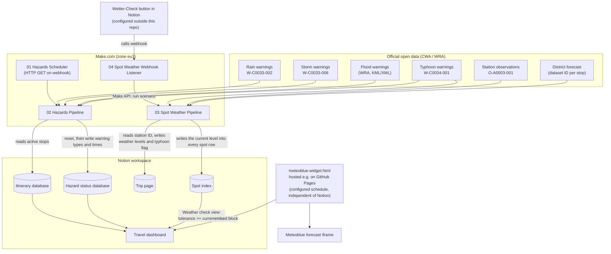
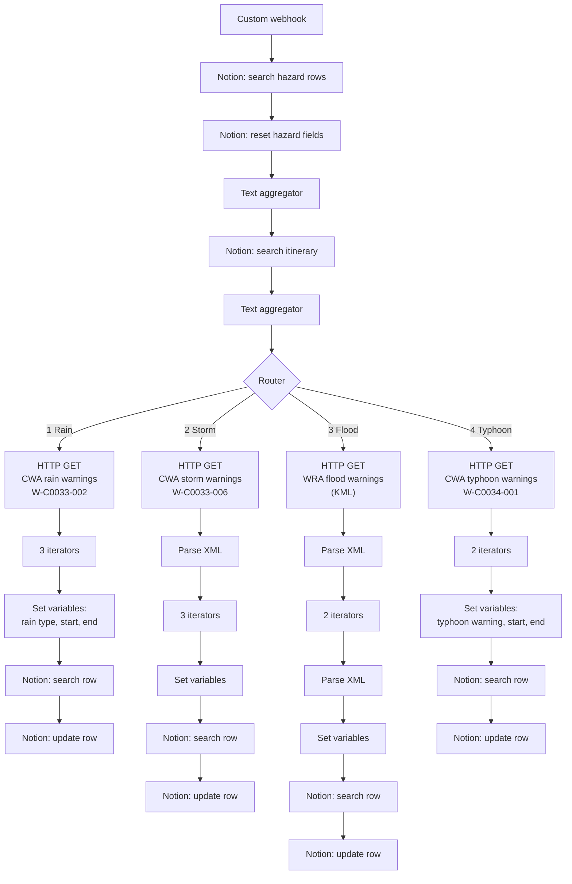
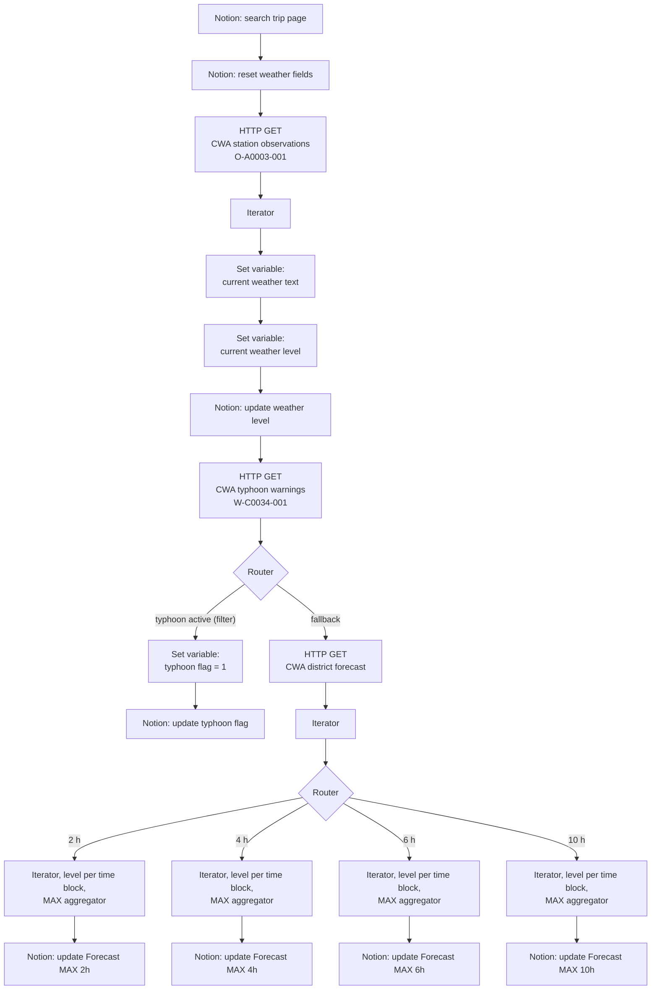
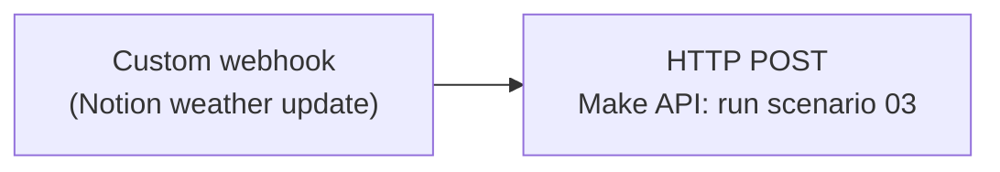
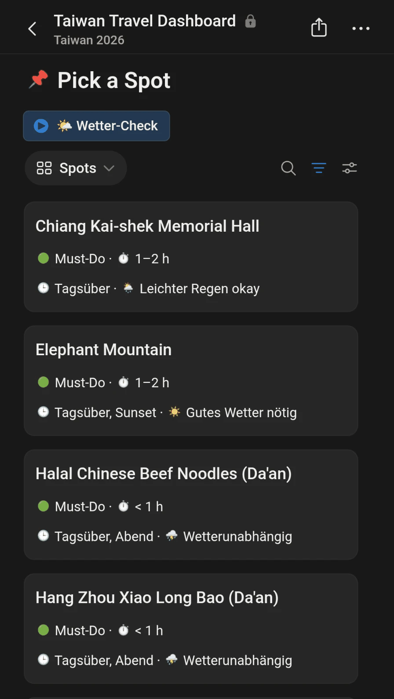

# 🇹🇼 Travel Risk & Weather Intelligence System (Taiwan)

A schedule- and event-driven automation built with **Make.com** that pulls official Taiwanese weather and hazard data (CWA / WRA open data), derives simple weather and hazard indicators, and writes them into a **Notion travel workspace**. Everything can be shown on one Notion dashboard, including an embedded Meteoblue forecast widget for the current stop of the trip.

---

## 📌 Purpose

When traveling through regions prone to typhoons, heavy rain and floods, checking forecasts manually is easy to forget. This project automates the following:

- Fetch official rain, storm, flood and typhoon warnings and map them to the stops of the itinerary.
- Evaluate the current weather at the active stop and store a weather level (1–4).
- Store the maximum forecast level for the next 2, 4, 6 and 10 hours.
- Raise a typhoon flag if a typhoon warning is active.
- Filter the "Pick a Spot" list on the dashboard down to the activities that still work in the current weather.
- Show a location-aware forecast widget inside the Notion dashboard.

---

## 📐 Architecture & Data Flow



> **Note:** The widget does **not** read from Notion. It selects the location from a date schedule configured in the HTML file (see [Widget](#5-dashboard-widget-srcmeteoblue-widgethtml)).

> **Blueprint files vs. full scenarios:** The diagrams below show the complete scenarios as they are built in Make.com. The JSON files in `blueprints/` are anonymized, English-translated **reference versions** and are reduced: `02_hazards_main.json` contains only the rain-warning route, and `03_spot_weather_main.json` contains the current-weather evaluation and a simple typhoon flag loop, but no forecast branch and no spot-index write. See [Notes on the blueprint files](#-notes-on-the-blueprint-files).

---

## 📁 Repository Structure

```
.
├── README.md
├── LICENSE
├── blueprints/
│   ├── 01_hazards_scheduler.json
│   ├── 02_hazards_main.json
│   ├── 03_spot_weather_main.json
│   └── 04_spot_weather_webhook.json
├── docs/
│   └── pick-a-spot.png
└── src/
    └── meteoblue-widget.html
```

---

## ⚙️ Subsystems

### 1. Hazards Scheduler (`01_hazards_scheduler.json`)

A single scheduled HTTP module that sends a GET request to the webhook URL of scenario 02. The run interval is configured in the Make.com scenario settings and is **not** part of the exported blueprint.

### 2. Hazards Pipeline (`02_hazards_main.json`)

Triggered by a custom webhook. It resets the hazard fields, loads the relevant stops and then queries four warning sources via a router. Each route parses the response, extracts the warning type and its start/end time, and writes them to the matching row of the hazard status database.



**Regional mapping:** CWA county/city names are matched with the stops of the itinerary:

| CWA `locationName` | Location |
| :--- | :--- |
| `臺北市` | `Taipei` |
| `嘉義縣` | `Alishan` |
| `屏東縣` | `Xiaoliuqiu` |
| `高雄市` | `Kaohsiung` |
| `花蓮縣` | `Hualien` |

### 3. Spot Weather Pipeline (`03_spot_weather_main.json`)

Starts with a search in Notion (no trigger module) and can be started by a schedule or by scenario 04 through the Make API.



**Current weather level:** the weather text of the returned station is converted into a level via nested keyword matching (first match wins, checked from top to bottom):

| Keywords (Chinese) | Meaning | Level |
| :--- | :--- | :---: |
| `雷`, `豪雨`, `大雨` | thunder, torrential rain, heavy rain | **4** |
| `短暫`, `陣雨`, `小雨` | brief/short-lived, showers, light rain | **3** |
| `陰`, `雲` | overcast, cloud | **2** |
| anything else | clear / normal | **1** |

**Typhoon flag:** set to `1` if a land warning (`陸上颱風警報`) or a sea-and-land warning (`海上陸上颱風警報`) is active (`expires` in the future).

**Forecast levels:** when no typhoon route matched, the fallback route requests the district forecast, derives a level for each time block and stores the maximum for the next 2, 4, 6 and 10 hours.

**Spot filtering:** in the full setup this scenario also writes the current level into every row of the spot index, which drives the "Pick a Spot" list on the dashboard — see [Spot filtering](#spot-filtering-pick-a-spot).

### 4. Webhook Listener (`04_spot_weather_webhook.json`)



Receives a call on a Make custom webhook and starts scenario 03 immediately via the Make API (`POST /api/v2/scenarios/{scenarioId}/run`, token authentication). This allows an on-demand refresh, e.g. after changing the itinerary.

On the dashboard this is wired to the **Wetter-Check** button in the "Pick a Spot" section (see the [screenshot](#spot-filtering-pick-a-spot)): pressing it calls this webhook, scenario 03 runs, and the spot list re-filters against the fresh weather level.

The Notion-side trigger that calls this webhook (a Notion button or automation) is **not** part of this repository and has to be set up separately.

### 5. Dashboard Widget (`src/meteoblue-widget.html`)

A standalone HTML page embedding a Meteoblue forecast widget (dark layout, 4 days) in an iframe.

- **Hosting:** The page has to be served over HTTPS (for example via GitHub Pages) and is then embedded into the Notion dashboard with an embed block. Publishing the file as `index.html` on GitHub Pages is enough.
- **Schedule-based location:** The `SCHEDULE` array at the top of the script maps date ranges (in the `Asia/Taipei` timezone) to one of five locations: `taipei`, `alishan`, `xiaoliuqiu`, `kaohsiung`, `hualien`. Outside all ranges, `DEFAULT_LOCATION` is used. The schedule ships with **example dates**; replace them with your own itinerary. It is **not** synchronized with Notion, so changes to the itinerary in Notion must be repeated here.
- **Manual override:** `?location=<name>` shows a specific location instead of the one from the schedule, e.g. `index.html?location=hualien`.
- **Auto-switch:** Every 60 seconds the page re-evaluates the schedule locally and re-renders the iframe only if the location changed. No network requests are made besides loading the Meteoblue widget.

---

## 🗄️ Notion Structure

The Make.com scenarios expect the following structure. Names must match the blueprints or be remapped after import.

**Itinerary database** (read by scenario 02)

| Property | Type | Purpose |
| :--- | :--- | :--- |
| `Location` | Select | Stop name; must match the values in the mapping table |
| `Status` | Status | Values `🟢 Current`, `🟡 Next Stop`, `⚪ Upcoming` |

**Trip page** (`{{YOUR_NOTION_MAIN_PAGE_ID}}`, read and updated by scenario 03)

| Property | Type | Purpose |
| :--- | :--- | :--- |
| `StationID` | Formula (text) | CWA station ID of the active stop |
| `HazardLevel` | Number | Current weather level 1–4 |
| `Forecast-MAX` | Number | Typhoon flag (0/1) in the blueprint |

In the full setup, the trip page additionally stores the forecast maxima per horizon (2 h, 4 h, 6 h, 10 h) and a separate typhoon flag.

**Hazard status database** (reset and updated by scenario 02)

| Property | Type | Written by the blueprint? |
| :--- | :--- | :---: |
| `Rain Start` | Date | ✅ |
| `Rain End` | Date | ✅ |
| `Typhoon Start` | Date | reset only |
| `Typhoon End` | Date | reset only |
| `Storm Level` | Number | reset only |

In the full setup, the hazard database holds start/end times (and levels) for rain, storm, flood and typhoon warnings.

Everything else (dashboard layout, calendar, transfers, bookings, guides) is maintained in Notion and only consumes the resulting values.

### Weather level scale

The same 1–4 scale is used twice: once for the **current weather level** at the active stop (derived by scenario 03) and once for the **weather tolerance** of each spot in the spot index.

| Level | Meaning for a spot |
| :---: | :--- |
| 1 | ☀️ Good weather required |
| 2 | ☁️ Cloudy is fine |
| 3 | 🌦️ Light rain is fine |
| 4 | ⛈️ Independent of weather |

### Spot filtering ("Pick a Spot")

The weather levels are not just displayed — they decide **which activities the dashboard still offers**. This is what the "Pick a Spot" section on the dashboard does.

<p align="center">
  
</p>

The **Wetter-Check** ("weather check") button at the top runs the Make scenario on demand: it calls the webhook of scenario 04, which starts scenario 03 through the Make API. Once the run finishes, the spot cards below reflect the fresh weather level. In the state shown above every spot is listed — including `Gutes Wetter nötig`, which only survives at level 1 — so the current level is 1.

Every spot is tagged once, by hand, with the worst conditions it still makes sense in. An outdoor viewpoint is tolerance `1`, a temple courtyard `3`, an indoor museum or a beef noodle shop `4`. Scenario 03 then writes the current weather level of the active stop into **every row of the spot index**, and a formula compares the two values per row:

```
Weather OK  =  Weather tolerance >= Current level
```

The "Weather check" view of the spot database filters on that formula, so the list shrinks and grows on its own as the weather changes:

| Current level | Spots shown |
| :---: | :--- |
| 1 ☀️ | everything (tolerance 1–4) |
| 2 ☁️ | tolerance 2–4 — outdoor viewpoints drop out |
| 3 🌦️ | tolerance 3–4 |
| 4 ⛈️ | tolerance 4 only — indoor spots, night markets, food |

The practical effect: during a heavy-rain warning the dashboard stops suggesting Elephant Mountain and leaves the museums and indoor food spots on the list, without anyone having to re-filter by hand.

The dashboard itself is kept in German. Its labels map to this README as follows:

| Label in the screenshot | English | Tolerance |
| :--- | :--- | :---: |
| `Gutes Wetter nötig` | Good weather required | 1 |
| `Leichter Regen okay` | Light rain is fine | 3 |
| `Wetterunabhängig` | Independent of weather | 4 |
| `Tagsüber`, `Abend` | daytime, evening | – |
| `Wetter-Check` | weather check (refresh button) | – |

**Spot index** (`Taiwan Spot Index`, written by scenario 03 in the full setup)

Every spot carries four hand-maintained attributes — priority, duration, time of day and the weather it needs — plus the two fields the automation uses to filter it:

| Property | Type | Purpose |
| :--- | :--- | :--- |
| `Name` | Title | Spot name |
| `Priority` | Select | `Must-Do`, `Should-Do`, `Could-Do` |
| `Duration` | Select | e.g. `< 1 h`, `1–2 h`, `½ day` |
| `Time of day` | Multi-select | e.g. `daytime`, `evening`, `sunset` |
| `Weather tolerance` | Number | Worst conditions the spot still works in (1–4), maintained by hand |
| `Current level` | Number | Current weather level of the active stop, overwritten on every run |
| `Weather OK` | Formula | `Weather tolerance >= Current level`; the "Weather check" view filters on it |

> Property names above are the ones used in this setup; adapt them to your own workspace. The spot-index write is **not** part of the reduced blueprint files — see [Notes on the blueprint files](#-notes-on-the-blueprint-files).

> The blueprints reference Notion properties by their **internal IDs** in some modules and by **names** in others. After importing into your own workspace, re-select the databases and remap all fields in every Notion module.

---

## 🚀 Setup

1. **Clone the repository**

   ```bash
   git clone https://github.com/YOUR_USERNAME/travel-weather-intelligence-system.git
   ```

2. **Import the blueprints into Make.com:** create a new scenario, choose **Options → Import Blueprint** and select one of the files from `blueprints/`. Repeat for all four files. The blueprints target the `eu1.make.com` zone; if your account is in a different zone, adjust the URLs in scenarios 01 and 04.

3. **Replace the placeholders** (see the table below) in the imported modules and remap the Notion fields.

4. **Set up the triggers:** copy the webhook URLs of scenarios 02 and 04 into the corresponding places, schedule scenario 01, and configure the Notion automation that calls webhook 04.

5. **Publish the widget:** insert your Meteoblue credentials, replace the example dates in `SCHEDULE` with your own trip, host the file (e.g. GitHub Pages) and embed the URL in your Notion dashboard.

### Placeholders

| Placeholder | Where | Description |
| :--- | :--- | :--- |
| `{{CWA_API_KEY}}` | 02, 03 | CWA Open Data API authorization token |
| `{{YOUR_NOTION_CONNECTION_ID}}` | 02, 03 | Your Notion connection in Make |
| `{{NOTION_HAZARDS_DATABASE_ID}}` | 02 | Hazard status database |
| `{{NOTION_ITINERARY_DATABASE_ID}}` | 02 | Itinerary database |
| `{{NOTION_MAIN_DATABASE_ID}}` | 03 | Database containing the page updated by scenario 03 |
| `{{YOUR_NOTION_MAIN_PAGE_ID}}` | 03 | Notion page whose station ID is read and whose fields are updated |
| `{{YOUR_HAZARDS_WEBHOOK_ID}}` | 01, 02 | Webhook ID of scenario 02 |
| `{{YOUR_SPOT_WEATHER_WEBHOOK_ID}}` | 04 | Webhook ID of scenario 04 |
| `{{YOUR_SCENARIO_ID}}` | 04 | ID of scenario 03 (target of the run call) |
| `{{YOUR_MAKE_API_TOKEN}}` | 04 | Make API token allowed to run scenarios |
| `{{YOUR_USER_KEY}}`, `{{YOUR_EMBED_KEY}}`, `{{YOUR_SIG}}` | widget | Meteoblue widget credentials |

> **Tip:** Make uses `{{ ... }}` for its own mapping expressions. After import, some placeholders may show up as empty or invalid mappings. Simply overwrite the affected fields with your real values in the module settings.

---

## 📝 Notes on the blueprint files

The blueprints in `blueprints/` are reduced reference versions of the scenarios shown above. For these files the following limitations apply:

- **Typhoon flag (`03`):** the flag is written once per warning in the CWA response, so the **last warning** in the list determines the final value. If there are no warnings at all, the loop does not run and the field stays empty (reset state) instead of `0`. The flag is not location-specific.
- **Hazard alerts (`02`):** only the rain-warning route is included, and all alert types from `W-C0033-002` are written to `Rain Start` / `Rain End`; there is no filtering by phenomenon. The typhoon and storm fields are reset but never filled.
- **Reset before fetch (`02`):** the hazard fields are cleared before calling CWA. If the API call fails, the fields stay empty until the next successful run.
- **Single-row assumption (`02`):** the hazard status database is addressed through `{{18.id}}` (the search result) and the area of that row is not compared with the alert's location. It works as intended with a single row; with several rows, each search result would multiply the downstream API calls and every row could receive the same alert times.
- **Missing observations (`03`):** the level logic is keyword-based. A missing or invalid weather value results in level 1 ("normal").
- **No spot filtering (`03`):** the blueprint writes the weather level only to the trip page. The step that pushes the current level into every row of the spot index — the basis for the "Pick a Spot" filter described above — is part of the full scenario and is not included here.
- **Widget schedule:** duplicated logic – the itinerary in Notion and the widget schedule are maintained separately.

---

## 🛠️ Tech Stack

- **Automation:** Make.com (scenarios, routers, iterators, aggregators, custom webhooks, Make API)
- **Data:** CWA Open Data API (`W-C0033-002`, `W-C0033-006`, `W-C0034-001`, `O-A0003-001`, district forecast), WRA flood warnings (KML/XML), Notion API
- **Frontend:** plain HTML/CSS/JavaScript (`Intl.DateTimeFormat`, iframe embed), Meteoblue widget, GitHub Pages

---

## 🔐 Security & Privacy

- API keys, tokens, connection IDs, database/page IDs, webhook IDs and widget credentials have been replaced by placeholders (see table above). Never commit real credentials.
- The Make API token in scenario 04 can start scenarios in your account. Keep it secret and scope it as narrowly as possible.
- Webhook URLs and scenario IDs are visible in Make screenshots and in the browser address bar. Crop or blur them before sharing images.
- The widget ships with example dates only. Keep your real travel dates out of public repositories.
- Do not commit Notion exports of booking pages: they can contain confirmation links with access keys, phone numbers and e-mail addresses.

---

## 📄 License

This project is licensed under the [MIT License](LICENSE).
