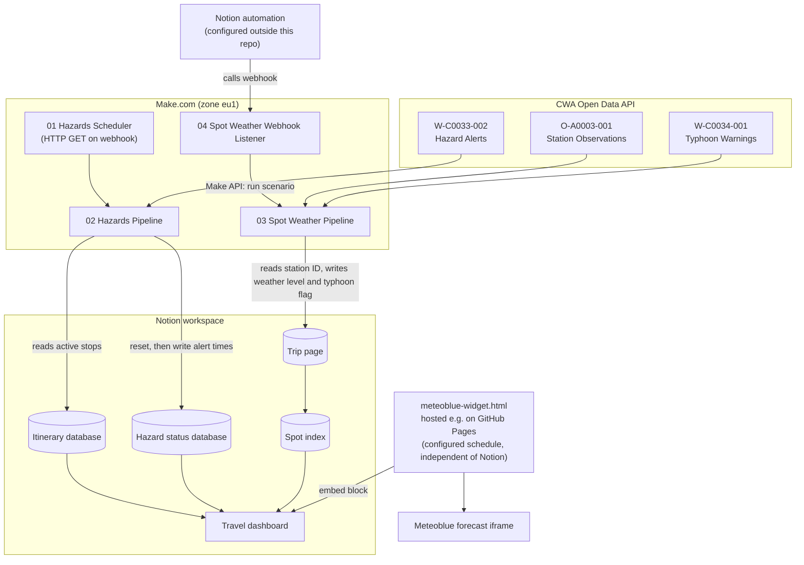

# 🇹🇼 Travel Risk & Weather Intelligence System (Taiwan)

A schedule- and event-driven automation built with **Make.com** that pulls official Taiwanese weather data from the **CWA Open Data API**, derives simple weather and hazard indicators, and writes them into a **Notion travel workspace**. Everything can be shown on one Notion dashboard, including an embedded Meteoblue forecast widget for the current stop of the trip.

---

## 📌 Purpose

When traveling through regions prone to typhoons and heavy rain, checking forecasts manually is easy to forget. This project automates the following:

- Fetch official hazard alerts and map them to the stops of the itinerary.
- Evaluate the current weather at the active stop and store a weather level (1–4).
- Raise a typhoon flag if a land typhoon warning is active.
- Use the weather level in Notion to help pick suitable spots.
- Show a location-aware forecast widget inside the Notion dashboard.

---

## 📐 Architecture & Data Flow



> **Note:** The widget does **not** read from Notion. It selects the location from a date schedule configured in the HTML file (see [Widget](#4-dashboard-widget-srcmeteoblue-widgethtml)).

> **Scope note:** The blueprints in this repository are anonymized: names, labels and IDs are generic English placeholders. A real workspace may contain additional fields that these blueprints do not touch, for example multi-horizon forecast levels or separate rain/storm/flood/typhoon hazard fields.

---

## 📁 Repository Structure

```
.
├── README.md
├── blueprints/
│   ├── 01_hazards_scheduler.json
│   ├── 02_hazards_main.json
│   ├── 03_spot_weather_main.json
│   └── 04_spot_weather_webhook.json
└── src/
    └── meteoblue-widget.html
```

---

## ⚙️ Subsystems

### 1. Hazard Alerts & Regional Mapping (`01_hazards_scheduler.json`, `02_hazards_main.json`)

**01 – Scheduler:** A single HTTP module that sends a GET request to the webhook URL of scenario 02. The run interval is configured in the Make.com scenario settings and is **not** part of the exported blueprint.

**02 – Hazards Pipeline** (triggered by a custom webhook):

1. **Reset:** Searches the hazard status database and sets five fields to empty (`Typhoon Start`, `Typhoon End`, `Storm Level`, `Rain Start`, `Rain End`).
2. **Load itinerary:** Searches the itinerary database for entries with the status `🟢 Current`, `🟡 Next Stop` or `⚪ Upcoming`.
3. **Fetch alerts:** Calls CWA dataset `W-C0033-002` and iterates over all returned locations.
4. **Map & filter:** A router filter ("Relevant Location Filter") compares the `Location` property of each itinerary entry with the CWA county/city name:

   | CWA `locationName` | Location |
   | :--- | :--- |
   | `臺北市` | `Taipei` |
   | `嘉義縣` | `Alishan` |
   | `屏東縣` | `Xiaoliuqiu` |
   | `高雄市` | `Kaohsiung` |
   | `花蓮縣` | `Hualien` |

5. **Write:** For matching pairs, the alert's `startTime` / `endTime` are written to `Rain Start` / `Rain End` in the hazard status database.

### 2. Spot Weather & Typhoon Evaluation (`03_spot_weather_main.json`)

1. Reads a fixed Notion page (`{{YOUR_NOTION_MAIN_PAGE_ID}}`) and resets `HazardLevel` and `Forecast-MAX`.
2. Takes the CWA station ID from the formula property `StationID` of that page and requests the current observation from `O-A0003-001`.
3. Reads the weather text of the returned station and derives a level via nested keyword matching (first match wins, checked from top to bottom):

   | Keywords (Chinese) | Meaning | Level |
   | :--- | :--- | :---: |
   | `雷`, `豪雨`, `大雨` | thunder, torrential rain, heavy rain | **4** |
   | `短暫`, `陣雨`, `小雨` | brief/short-lived, showers, light rain | **3** |
   | `陰`, `雲` | overcast, cloud | **2** |
   | anything else | clear / normal | **1** |

4. Writes the level to **`HazardLevel`**.
5. Requests typhoon warnings from `W-C0034-001` and iterates over the warnings. For each warning the flag is `1` if the type is `陸上颱風警報` (land warning) or `海上陸上颱風警報` (sea and land warning) **and** `expires` is in the future, otherwise `0`.
6. Writes the flag to **`Forecast-MAX`**.

### 3. Webhook Listener (`04_spot_weather_webhook.json`)

Receives a call on a Make custom webhook and starts scenario 03 immediately via the Make API (`POST /api/v2/scenarios/{scenarioId}/run`, token authentication). This allows an on-demand refresh, e.g. after changing the itinerary.

The Notion-side trigger that calls this webhook (e.g. a Notion automation or button) is **not** part of this repository and has to be set up separately. Scenario 03 has no schedule in this repository; it runs when triggered through this webhook, or when a schedule is added manually in Make.

### 4. Dashboard Widget (`src/meteoblue-widget.html`)

A standalone HTML page embedding a Meteoblue forecast widget (dark layout, 4 days) in an iframe.

- **Hosting:** The page has to be served over HTTPS (for example via GitHub Pages) and is then embedded into the Notion dashboard with an embed block. Publishing the file as `index.html` on GitHub Pages is enough.
- **Schedule-based location:** The `SCHEDULE` array at the top of the script maps date ranges (in the `Asia/Taipei` timezone) to one of five locations: `taipei`, `alishan`, `xiaoliuqiu`, `kaohsiung`, `hualien`. Outside all ranges, `DEFAULT_LOCATION` is used. The schedule ships with **example dates**; replace them with your own itinerary. It is **not** synchronized with Notion, so changes to the itinerary in Notion must be repeated here.
- **Manual override:** `?location=<name>` forces a location, e.g. `index.html?location=hualien`.
- **Auto-switch:** Every 60 seconds the page re-evaluates the schedule locally and re-renders the iframe only if the location changed. No network requests are made besides loading the Meteoblue widget.

---

## 🗄️ Notion Structure

The Make.com scenarios expect the following structure. Names must match the blueprints or be remapped after import.

**Itinerary database** (read by scenario 02)

| Property | Type | Purpose |
| :--- | :--- | :--- |
| `Location` | Select | Stop name; must match the values in the mapping table |
| `Status` | Status | Values `🟢 Current`, `🟡 Next Stop`, `⚪ Upcoming` |

**Trip page** (`{{YOUR_NOTION_MAIN_PAGE_ID}}`, read and updated by scenario 03)

| Property | Type | Purpose |
| :--- | :--- | :--- |
| `StationID` | Formula (text) | CWA station ID of the active stop |
| `HazardLevel` | Number | Weather level 1–4 |
| `Forecast-MAX` | Number | Typhoon flag (0/1) |

**Hazard status database** (reset and updated by scenario 02)

| Property | Type | Written by 02? |
| :--- | :--- | :---: |
| `Rain Start` | Date | ✅ |
| `Rain End` | Date | ✅ |
| `Typhoon Start` | Date | reset only |
| `Typhoon End` | Date | reset only |
| `Storm Level` | Number | reset only |

Everything else (dashboard layout, spot index, calendar, transfers, bookings, guides) is maintained in Notion and only consumes the resulting values.

### Weather level scale

The same 1–4 scale can be used for the current level and for the weather tolerance of each spot in a spot index:

| Level | Meaning for a spot |
| :---: | :--- |
| 1 | ☀️ Good weather required |
| 2 | ☁️ Cloudy is fine |
| 3 | 🌦️ Light rain is fine |
| 4 | ⛈️ Independent of weather |

> The blueprints reference Notion properties by their **internal IDs** in some modules and by **names** in others. After importing into your own workspace, re-select the databases and remap all fields in every Notion module.

---

## 🚀 Setup

1. **Clone the repository**

   ```bash
   git clone https://github.com/YOUR_USERNAME/travel-weather-intelligence-system.git
   ```

2. **Import the blueprints into Make.com:** create a new scenario, choose **Options → Import Blueprint** and select one of the files from `blueprints/`. Repeat for all four files. The blueprints target the `eu1.make.com` zone; if your account is in a different zone, adjust the URLs in scenarios 01 and 04.

3. **Replace the placeholders** (see the table below) in the imported modules and remap the Notion fields.

4. **Set up the triggers:** copy the webhook URLs of scenarios 02 and 04 into the corresponding places, schedule scenario 01, and configure the Notion automation that calls webhook 04.

5. **Publish the widget:** insert your Meteoblue credentials, replace the example dates in `SCHEDULE` with your own trip, host the file (e.g. GitHub Pages) and embed the URL in your Notion dashboard.

### Placeholders

| Placeholder | Where | Description |
| :--- | :--- | :--- |
| `{{CWA_API_KEY}}` | 02, 03 | CWA Open Data API authorization token |
| `{{YOUR_NOTION_CONNECTION_ID}}` | 02, 03 | Your Notion connection in Make |
| `{{NOTION_HAZARDS_DATABASE_ID}}` | 02 | Hazard status database |
| `{{NOTION_ITINERARY_DATABASE_ID}}` | 02 | Itinerary database |
| `{{NOTION_MAIN_DATABASE_ID}}` | 03 | Database containing the page updated by scenario 03 |
| `{{YOUR_NOTION_MAIN_PAGE_ID}}` | 03 | Notion page whose station ID is read and whose fields are updated |
| `{{YOUR_HAZARDS_WEBHOOK_ID}}` | 01, 02 | Webhook ID of scenario 02 |
| `{{YOUR_SPOT_WEATHER_WEBHOOK_ID}}` | 04 | Webhook ID of scenario 04 |
| `{{YOUR_SCENARIO_ID}}` | 04 | ID of scenario 03 (target of the run call) |
| `{{YOUR_MAKE_API_TOKEN}}` | 04 | Make API token allowed to run scenarios |
| `{{YOUR_USER_KEY}}`, `{{YOUR_EMBED_KEY}}`, `{{YOUR_SIG}}` | widget | Meteoblue widget credentials |

> **Tip:** Make uses `{{ ... }}` for its own mapping expressions. After import, some placeholders may show up as empty or invalid mappings. Simply overwrite the affected fields with your real values in the module settings.

---

## ⚠️ Known Limitations

- **Typhoon flag:** the flag is written once per warning in the CWA response, so the **last warning** in the list determines the final value. If there are no warnings at all, the loop does not run and the field stays empty (reset state) instead of `0`. The flag is not location-specific.
- **Hazard alerts:** all alert types from `W-C0033-002` are written to `Rain Start` / `Rain End`; there is no filtering by phenomenon. The typhoon and storm fields are reset but never filled.
- **Reset before fetch:** scenario 02 clears the hazard fields before calling CWA. If the API call fails, the fields stay empty until the next successful run.
- **Single-row assumption:** scenario 02 addresses the hazard status database through `{{18.id}}` (the search result) and does not compare the area of that row with the alert's location. It works as intended with a single row; with several rows, each search result would multiply the downstream API calls and every row could receive the same alert times.
- **Missing observations:** the severity logic is keyword-based. A missing or invalid weather value results in level 1 ("normal").
- **Widget schedule:** duplicated logic – the itinerary in Notion and the widget schedule are maintained separately.

---

## 🛠️ Tech Stack

- **Automation:** Make.com (scenarios, routers, custom webhooks, Make API)
- **Data:** CWA Open Data API (`W-C0033-002`, `O-A0003-001`, `W-C0034-001`), Notion API
- **Frontend:** plain HTML/CSS/JavaScript (`Intl.DateTimeFormat`, iframe embed), Meteoblue widget, GitHub Pages

---

## 🔐 Security & Privacy

- API keys, tokens, connection IDs, database/page IDs, webhook IDs and widget credentials have been replaced by placeholders (see table above). Never commit real credentials.
- The Make API token in scenario 04 can start scenarios in your account. Keep it secret and scope it as narrowly as possible.
- The widget ships with example dates only. Keep your real travel dates out of public repositories.
- Do not commit Notion exports of booking pages: they can contain confirmation links with access keys, phone numbers and e-mail addresses.
